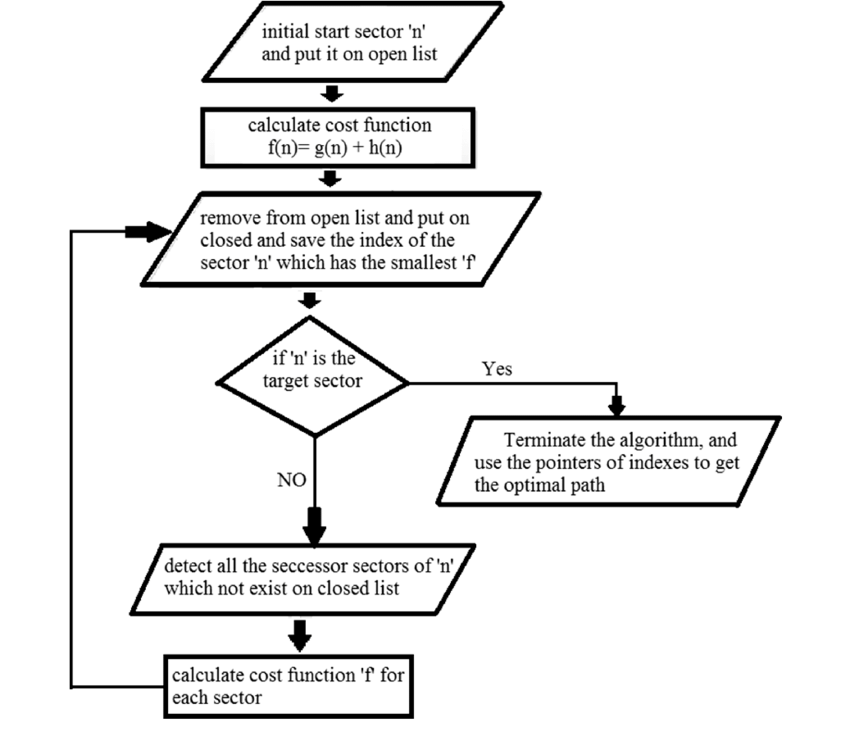

# A-star-PathFinder-
simulation of the A* algorithm of pathfinding using python and the py game package for the display

<h2>A* algorithm</h2>

A* algorithm is a graph traversal and path search algorithm, which is often used in many fields of computer science due to its completeness, optimality, and optimal efficiency. One major practical drawback is its space complexity, as it stores all generated nodes in memory. Thus, in practical travel-routing systems, it is generally outperformed by algorithms which can pre-process the graph to attain better performance, as well as memory-bounded approaches; however, A* is still the best solution in many cases.

Peter Hart, Nils Nilsson and Bertram Raphael of Stanford Research Institute first published the algorithm in 1968. It can be seen as an extension of Edsger Dijkstra's 1959 algorithm. A* achieves better performance by using heuristics to guide its search.

for more information and explanation check <a href='https://www.youtube.com/watch?v=ySN5Wnu88nE&t=520s'>this video </a>

<h3>uml sequence</h3>

<h2>the programe</h2>

in this project we used python as a programing language and we used pygame package for display 

the first left mouse click is to add the start node ,the second click is for the end node , the other clicks are to make the obstacls,to undo use right click
,to start press the keyboard key space

before running hte code check for the package pygame ,to install run pip install pygame

<h2>screen shots </h2>

original video from <a href='https://www.youtube.com/watch?v=JtiK0DOeI4A'>this video</a>

